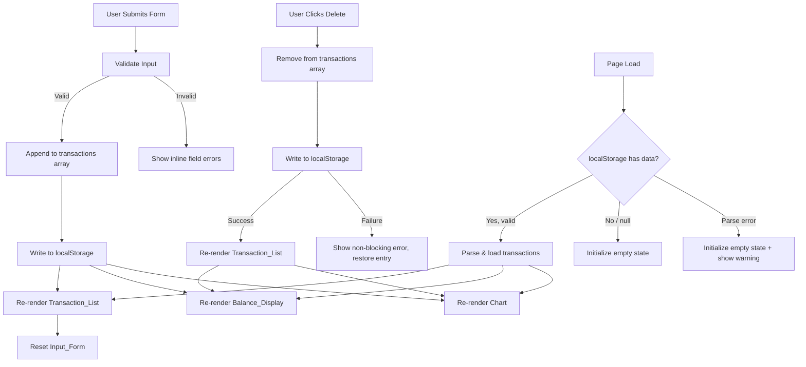

# Design Document: Expense & Budget Visualizer

## Overview

The Expense & Budget Visualizer is a single-page, client-side web application built with plain HTML, CSS, and Vanilla JavaScript. It allows users to record expense transactions, view a running total balance, and visualize spending by category through a live-updating pie chart. All data is persisted in the browser's `localStorage` with no backend or build tooling required.

The application is intentionally minimal in its technology footprint: one HTML file, one CSS file, one JS file, and Chart.js loaded from a CDN. This constraint shapes every architectural decision below.

---

## Architecture

The app follows a **unidirectional data flow** pattern:

```
User Action → State Mutation → localStorage Sync → UI Render
```

All application state lives in a single in-memory array (`transactions`). Every add or delete operation mutates this array, synchronously writes it to `localStorage`, then re-renders all dependent UI components (Transaction_List, Balance_Display, Chart). There is no event bus or reactive framework — render functions are called explicitly after each state change.



---

## Components and Interfaces

The application is divided into logical modules within the single JS file, each with a clear responsibility.

### 1. State Module

Holds the canonical in-memory state.

```js
// Internal state — not exported, accessed only through module functions
let transactions = []; // Transaction[]
```

**Transaction shape:**
```js
{
  id: string,        // crypto.randomUUID() or Date.now().toString()
  name: string,      // item name, trimmed, non-empty
  amount: number,    // positive float, max 2 decimal places
  category: string   // 'Food' | 'Transport' | 'Fun'
}
```

### 2. Storage Module

Wraps `localStorage` access with error handling.

```js
function saveTransactions(transactions)  // returns { ok: boolean, error?: Error }
function loadTransactions()              // returns { data: Transaction[] | null, error?: Error }
```

- `saveTransactions` serializes the array to JSON and writes to the key `'expense_transactions'`.
- `loadTransactions` reads and parses the key; returns `null` data on missing key or parse failure.
- Both functions catch all exceptions and return structured results rather than throwing.

### 3. Validator Module

Pure functions for input validation.

```js
function validateName(value)    // returns { valid: boolean, message: string }
function validateAmount(value)  // returns { valid: boolean, message: string }
function validateCategory(value) // returns { valid: boolean, message: string }
```

- `validateName`: trims whitespace; fails if result is empty.
- `validateAmount`: parses as float; fails if NaN, < 0.01, > 999,999,999.99, or has more than 2 decimal places.
- `validateCategory`: fails if value is not one of `'Food'`, `'Transport'`, `'Fun'`.

### 4. Form Controller

Handles `Input_Form` submit events.

```js
function handleFormSubmit(event)  // reads fields, validates, calls addTransaction or shows errors
function resetForm()              // clears all fields to default state
function showFieldError(fieldId, message)  // renders inline error under a field
function clearFieldErrors()       // removes all inline error messages
```

### 5. Transaction Controller

Handles add and delete operations.

```js
function addTransaction(name, amount, category)  // mutates state, syncs storage, re-renders all
function deleteTransaction(id)                   // mutates state, syncs storage, re-renders all
```

### 6. Render Module

Pure render functions — each reads from the `transactions` array and updates the DOM.

```js
function renderTransactionList()  // rebuilds the list DOM
function renderBalance()          // updates the balance text
function renderChart()            // updates the Chart.js instance
```

### 7. Chart Module

Manages the Chart.js pie chart instance.

```js
function initChart(canvasEl)      // creates the Chart.js instance
function updateChart(data)        // updates datasets and labels, calls chart.update()
```

`data` shape passed to `updateChart`:
```js
{
  labels: string[],   // e.g. ['Food', 'Transport']
  values: number[]    // matching totals per category
}
```

### 8. Formatter Module

Pure utility functions.

```js
function formatCurrency(amount)  // returns '$X,XXX.XX' or '$-X,XXX.XX'
function computeCategoryTotals(transactions)  // returns { Food: n, Transport: n, Fun: n }
function computeTotal(transactions)           // returns sum of all amounts
```

---

## Data Models

### Transaction (in-memory and localStorage)

| Field      | Type   | Constraints                                      |
|------------|--------|--------------------------------------------------|
| `id`       | string | Unique; generated at creation time               |
| `name`     | string | Non-empty after trimming whitespace              |
| `amount`   | number | 0.01 – 999,999,999.99; max 2 decimal places      |
| `category` | string | One of: `'Food'`, `'Transport'`, `'Fun'`         |

### localStorage Schema

- **Key**: `'expense_transactions'`
- **Value**: JSON-serialized `Transaction[]`
- **Example**: `[{"id":"1","name":"Coffee","amount":4.50,"category":"Food"}]`
- **Empty state**: `[]` or key absent

### Category Totals (derived, not stored)

Computed on demand from the `transactions` array:

```js
{ Food: number, Transport: number, Fun: number }
```

Only categories with a total > 0 are passed to the chart renderer.

---

## Correctness Properties

*A property is a characteristic or behavior that should hold true across all valid executions of a system — essentially, a formal statement about what the system should do. Properties serve as the bridge between human-readable specifications and machine-verifiable correctness guarantees.*

### Property 1: Valid transaction addition grows the list

*For any* transaction list and any valid transaction (non-empty name, amount in range, valid category), adding that transaction to the list must result in the list length increasing by exactly one, and the new transaction must be retrievable from the list by its id.

**Validates: Requirements 1.2, 2.1**

---

### Property 2: Whitespace-only names are rejected

*For any* string composed entirely of whitespace characters (spaces, tabs, newlines), submitting it as the item name must be rejected by the Validator, and the transaction list must remain unchanged.

**Validates: Requirements 1.3**

---

### Property 3: Amount validation rejects out-of-range and malformed values

*For any* numeric string that is either below 0.01, above 999,999,999.99, has more than 2 decimal places, or is non-numeric, the Validator must reject it and the transaction list must remain unchanged.

**Validates: Requirements 1.3**

---

### Property 4: localStorage round-trip preserves all transactions

*For any* array of valid transactions, serializing it to localStorage and then deserializing it must produce an array that is deeply equal to the original — all fields (`id`, `name`, `amount`, `category`) preserved exactly.

**Validates: Requirements 5.1, 5.2, 5.3**

---

### Property 5: Balance equals sum of all transaction amounts

*For any* transaction list, the value displayed by Balance_Display must equal the arithmetic sum of all `amount` fields in the list, formatted as `$X,XXX.XX`.

**Validates: Requirements 3.1, 3.2, 3.3**

---

### Property 6: Chart segment proportions match category totals

*For any* transaction list with at least one transaction, the proportion of each category's segment in the pie chart must equal that category's total divided by the sum of all amounts. Categories with a zero total must not appear as segments.

**Validates: Requirements 4.1, 4.6**

---

### Property 7: Delete then re-add is idempotent on list contents

*For any* transaction list and any transaction in that list, deleting the transaction and then adding an equivalent transaction (same name, amount, category) must result in a list with the same length as the original and a balance equal to the original balance.

**Validates: Requirements 2.4, 3.3**

---

### Property 8: Currency formatting is correct for all amounts

*For any* numeric amount (positive, zero, or negative), `formatCurrency` must return a string that starts with `$` (or `$-` for negatives), contains exactly 2 decimal places, and uses comma-separated thousands grouping.

**Validates: Requirements 3.1, 3.4, 3.5**

---

## Error Handling

### localStorage Unavailable

Some browsers disable `localStorage` in private/incognito mode or when storage quota is exceeded. The Storage Module wraps all `localStorage` calls in `try/catch`. If `saveTransactions` fails, the caller receives `{ ok: false, error }` and the UI shows a non-blocking toast/banner message. The in-memory state is still updated so the current session continues to work.

### localStorage Parse Error

If `loadTransactions` encounters a JSON parse error (corrupted data), it returns `{ data: null, error }`. The app initializes with an empty transaction list and displays a non-blocking warning banner.

### Form Validation Errors

Inline error messages are rendered directly beneath each invalid field. Errors are cleared on the next submit attempt. No alert dialogs are used.

### Delete Failure

If a delete operation's `saveTransactions` call fails, the transaction is restored to the in-memory array and re-rendered in the list. A non-blocking error message is shown.

### Chart Rendering Edge Cases

- **No transactions**: Chart canvas is hidden; an empty-state message is shown instead.
- **Single category**: Chart renders a full 100% single-segment pie.
- **Category reaches zero**: That category is excluded from the labels/values arrays passed to `updateChart`.

---

## Testing Strategy

### Applicability of Property-Based Testing

This feature is well-suited for property-based testing. The core logic — validation, currency formatting, category total computation, and localStorage serialization — consists of pure functions with clear input/output contracts. Input variation meaningfully exercises edge cases (boundary amounts, whitespace strings, mixed categories), and running 100+ iterations is cheap since all logic is in-memory with no I/O.

The charting library integration and DOM rendering are not suitable for PBT; those are covered by example-based tests.

### Property-Based Testing Library

Use **[fast-check](https://fast-check.dev/)** (loaded via CDN or used in a test harness). Each property test runs a minimum of **100 iterations**.

Tag format for each test:
```
// Feature: expense-budget-visualizer, Property N: <property_text>
```

### Properties to Implement as PBT

| Property | Module Under Test | Generator Strategy |
|---|---|---|
| P1: Valid addition grows list | Transaction Controller | `fc.record({ name: fc.string({minLength:1}).filter(s => s.trim()), amount: fc.float({min:0.01, max:999999999.99}), category: fc.constantFrom('Food','Transport','Fun') })` |
| P2: Whitespace names rejected | Validator | `fc.stringOf(fc.constantFrom(' ','\t','\n'), {minLength:1})` |
| P3: Amount validation | Validator | `fc.oneof(fc.float({max:0}), fc.float({min:1000000000}), fc.string())` |
| P4: localStorage round-trip | Storage Module | `fc.array(transactionArbitrary)` |
| P5: Balance equals sum | Formatter + State | `fc.array(transactionArbitrary)` |
| P6: Chart proportions | Formatter + Chart Module | `fc.array(transactionArbitrary, {minLength:1})` |
| P7: Delete/re-add idempotent | Transaction Controller | `fc.array(transactionArbitrary, {minLength:1})` |
| P8: Currency formatting | Formatter | `fc.float({min:-1e9, max:1e9})` |

### Unit / Example-Based Tests

- Form submit with all valid fields → transaction added, form reset
- Form submit with empty name → inline error shown, list unchanged
- Page load with valid localStorage data → list, balance, chart all restored
- Page load with no localStorage data → empty state rendered
- Page load with corrupted localStorage → warning shown, empty state rendered
- Delete with localStorage failure → entry restored, error shown
- Single-category chart → full 100% segment rendered
- Empty chart → canvas hidden, empty-state message visible

### Integration Tests

- Full add → delete cycle: verify localStorage, list, balance, and chart all stay consistent
- Browser compatibility: manual smoke test in Chrome, Firefox, Edge, Safari

### What Is Not Tested

- Visual layout and CSS (manual review)
- Chart.js library internals (tested by Chart.js authors)
- Performance timing (manual profiling with DevTools)
